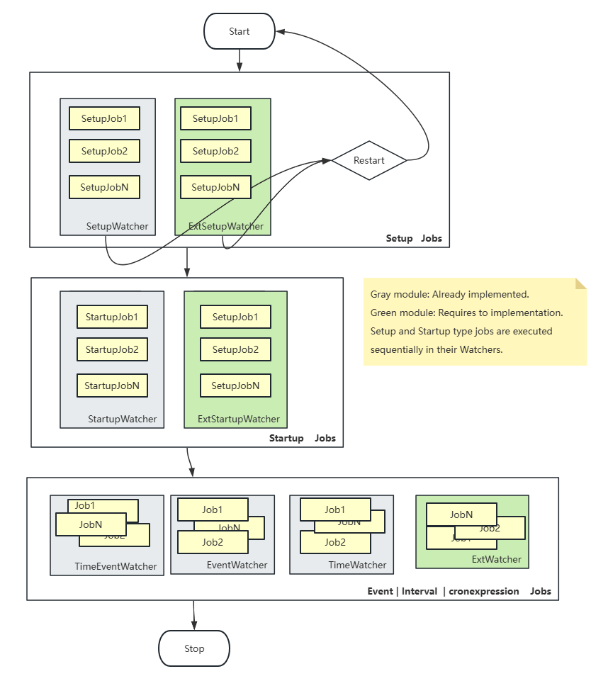

# JobAgent

```text
   __        _       _                    _   
   \ \  ___ | |__   /_\   __ _  ___ _ __ | |_ 
    \ \/ _ \| '_ \ //_\\ / _` |/ _ \ '_ \| __|
 /\_/ / (_) | |_) /  _  \ (_| |  __/ | | | |_ 
 \___/ \___/|_.__/\_/ \_/\__, |\___|_| |_|\__|
                         |___/                
```


[![Apache licensed][9]][10]
[![Docker][3]][4] 

[3]: https://img.shields.io/docker/image-size/aicrosoft/jobagent/latest
[4]: https://hub.docker.com/r/aicrosoft/jobagent
[9]: https://img.shields.io/badge/license-Apache-blue.svg
[10]: LICENSE

📖👉 [View the English documentation](../../README.md) 

[JobAgent](https://github.com/neatFactory/JobAgent ) 是一个易于使用和扩展的任务调度客户端，支持多种作业触发类型。它是使用 [JobsFactory](https://www.nuget.org/packages/Aicrosoft.Scheduling/ ) 任务调度框架实现的。使用 [dotnet8](https://dotnet.microsoft.com/en-us/ ) 编写。这是我对早期开源项目 [BeesTask](https://github.com/Aicrosoft/BeesTask ) 的升级和重构。


## 优势
- 支持多种任务触发类型: 
- - **Setup trigger** – 升级时触发；
- - **Interval trigger** – 定时间隔触发；
- - **Cron trigger** – Cron表达式触发；
- - **Event trigger** – 事件触发；
- 只需要继承一两个类，配置属性和重写对应的方法，即可实现自已的业务逻辑；   
- 通过一个dotnet库的以插件形式实现，结构清晰明了，易于管理和使用；

## 适用场景
- 定时循环触发一个任务，执行一些操作。比如大量的数据处理；
- 指定时间触发，执行某些特定时间要执行的操作。比如每个月的第一天处理；
- 根据事件触发，执行事件后续操作。比如目录自动更新转移；

## 常用使用举例
- DDNS的更新，可以定时执行，也可以跟据路由器发来的IP更新事件触发执行；
- 监视某个目录，当目录发生变化时，同步该目录内容到其它地方；
- 监视DB中的事件，根据发生的内容执行具体的业务；

## 支持的任务类型
`使用前请先根据已支持的任务类型，确定是否需要使用该框架。`   
| Value       | 类型       | 示例值             | 简介                                             |
| ----------- | :--------- | :----------------- | :----------------------------------------------- |
| Setup       | 安装与升级 | ""                 | 启动后运行                                       |
| Startup     | 启动任务   | "2000"             | Setup后所有任务前运行，延时2秒。可能会持续运行。 |
| Event       | 事件触发   | "DirChangeEventer" | 当指定目录变化时触发                             |
| Interval    | 间隔运行   | "00:00:20"         | 运行的间隔20秒                                   |
| Schedulable | Cron表达式 | "* 0/10 * * * ?"   | Cron表达式：每10分钟执行                         |

NOTE： `暂时不提供Job类型的扩展`。

------

- [JobAgent](#jobagent)
  - [优势](#优势)
  - [适用场景](#适用场景)
  - [常用使用举例](#常用使用举例)
  - [支持的任务类型](#支持的任务类型)
- [项目结构](#项目结构)
- [快速开始(简单示例)](#快速开始简单示例)
  - [Job的生命周期](#job的生命周期)
  - [描述一个Job](#描述一个job)
    - [代码实现](#代码实现)
    - [等价的应用配置实现](#等价的应用配置实现)
  - [Job触发后运行的Worker(对应于Job的WorkerName属性)](#job触发后运行的worker对应于job的workername属性)
- [框架中的主要角色](#框架中的主要角色)
  - [Job - 任务的配置](#job---任务的配置)
    - [appsettings.json中的配置](#appsettingsjson中的配置)
    - [等价的代码实现](#等价的代码实现)
  - [JobContext - 任务执行时的状态和上下文](#jobcontext---任务执行时的状态和上下文)
    - [自定义的CustomJobContext](#自定义的customjobcontext)
  - [Worker - 具体执行业务逻辑的工作单元](#worker---具体执行业务逻辑的工作单元)
    - [简单实现](#简单实现)
  - [Event - 事件触发类型的Job的启动事件自定义](#event---事件触发类型的job的启动事件自定义)
    - [简单实现](#简单实现-1)
  - [Watcher - 每个Watcher会监视某些类型的Job](#watcher---每个watcher会监视某些类型的job)
    - [事件Watcher的简单实现](#事件watcher的简单实现)
    - [自定义的Watcher的实现](#自定义的watcher的实现)
- [使用方法](#使用方法)
  - [从头开始创建](#从头开始创建)
    - [新建一个dotnet8的Console项目。](#新建一个dotnet8的console项目)
    - [修改Program.cs](#修改programcs)
    - [后续步骤](#后续步骤)
  - [插件模式 (推荐)](#插件模式-推荐)
    - [插件配置类](#插件配置类)
    - [重写ConfigureServices方法](#重写configureservices方法)
    - [后续步骤](#后续步骤-1)
- [配置](#配置)
  - [概述](#概述)
  - [Job的配置](#job的配置)
    - [Job配置示例](#job配置示例)
    - [Job参数说明](#job参数说明)
  - [TimeWatcher的配置](#timewatcher的配置)
  - [插件配置](#插件配置)
  - [公共参数配置](#公共参数配置)
  - [取得配置信息](#取得配置信息)
  - [动态加载配置](#动态加载配置)
- [运行JobAgent](#运行jobagent)
  - [手动运行](#手动运行)
  - [作为 Windows 服务](#作为-windows-服务)
  - [Docker 方式](#docker-方式)
    - [调试创建](#调试创建)
    - [生产环境](#生产环境)
    - [Docker参数说明](#docker参数说明)
- [贡献](#贡献)
- [特别感谢](#特别感谢)

---


# 项目结构

```tree
JobAgent.sln
└── JobAgent.Console          // 调用终端（执行入口）	
└── JobSamples                // 一些Job调用示例
```
- JobAgent.Console 并不依赖`JobSamples`库；
- JobSamples 生成后，拷入JobAgent.Console运行目录下的/Plugins/JobSamplesr即可；
- 如果没有插件模块，该项目不会有工作负载。


# 快速开始(简单示例)

## Job的生命周期
使用不同类型的Job实现不同类型的任务。

<details>
<summary>Job的任务执行工作流</summary>



</details>

## 描述一个Job

### 代码实现

<details>
<summary>示例</summary>

```cs
public class Interval10Sec : Job
{
    public Interval10Sec()
    {
        Trigger = "00:00:10";
    }
    public override string? WorkerName => nameof(SimapleWorker);
}
```

</details>

### 等价的应用配置实现

<details>
<summary>示例</summary>

```json
{
 "Jobs": {
   // SampleJobs is the module name, used to distinguish Jobs with the same Job name in multiple plugin modules.
   "SampleJobs": [
     {
       "name": "Interval10Sec",
       "trigger": "00:00:10",
       "workerName": "SimapleWorker"
     },
   ]
 }
}
```
</details>

## Job触发后运行的Worker(对应于Job的WorkerName属性)
通过下面的代码，即可在每10秒运行一次SimapleWorker.ExecuteAsync方法。

<details>
<summary>示例</summary>

```cs
[KeyedName]
public sealed class SimapleWorker(IServiceProvider serviceProvider) : Worker<JobContext>(serviceProvider)
{
    protected override async Task ExecuteAsync(CancellationToken cancellationToken)
    {
        await Task.Delay(500, cancellationToken); //mock execute 0.5 second.
        await ExecuteCallbackAsync(true);// work finish callback. It's not necessary.
    }
   
    protected override async Task ExecuteCallbackAsync<TResult>(TResult? result) where TResult : default
    {
        if (result is true)
            Logger.LogDebug($"Worker are success.");
        await Task.CompletedTask;
    }
}
```
</details>

> 注意CancellationToken信号的处理，在应用停止时会收到取消信号。


# 框架中的主要角色

为了更好的使用JobFactory框架，更深入的进行扩展与定制。深入了解框架中的相关角色很有必要。

> 可以访问 [Architecture UML](https://blog.aicro.net/posts/job-v8/v8-task-user-uml) 查看UML类图。

## Job - 任务的配置

- Job是对任务的描述，通过该描述可以设置它的工作类型，执行的业务逻辑单元。
- 由两种方式来配置它，一般是在应用程序配置`appsettings.json`或插件模块的配置`moduleAssemblyName.json`中，直接用代码来继承Job类可以等价实现。
- Job的Trigger一旦设定就不要再修改它的类型。

### appsettings.json中的配置

<details>
<summary>示例</summary>

```json
{
 "Jobs": {
   // SampleJobs is the module name, used to distinguish Jobs with the same Job name in multiple plugin modules.
   "SampleJobs": [
     {
       "name": "Interval10Sec",
       "trigger": "00:00:10",
       "workerName": "SimapleWorker"
     },
   ]
 }
}
```

</details>

###  等价的代码实现

<details>
<summary>示例</summary>

```cs
public class Interval10Sec : Job
{
    public Interval10Sec()
    {
        Trigger = "00:00:10";
    }
    public override string? WorkerName => nameof(SimapleWorker);
}
```

</details>

## JobContext - 任务执行时的状态和上下文
- JobContext是每个Job对应的上下文与状态，它会在首次运行后持久化到默认的/states/目录下。
- 任务再次运行时会读取上次的持久化状态并恢复成当前的JobContext。
- 每个JobContext都必须实现对应的JobFactory，以创建对应的上下文。
- 也可以不创建自定的JobContext，而是直接使用它，可以通过Data属性来设置和取得不同的工作状态。

### 自定义的CustomJobContext

<details>
<summary>示例</summary>

```cs
public sealed class CustomJobContext : JobContext
{
    public bool Done
    {
        get; set;
    }
}

public sealed class CustomJobContextFactory(IServiceProvider serviceProvider)
    : JobContextServiceBase(serviceProvider), IJobContextFactory<CustomJobContext>, ITransient
{
    public override CustomJobContext LoadOrCreate(IJob job)
    {
        var ctx = LoadOrCreateNew(job, Create);
        return ctx;
    }

    protected override CustomJobContext Create() => new();
}

```

</details>


## Worker - 具体执行业务逻辑的工作单元
- 通过KeyedName来以类的名称注册到DI，也可以用字符串指定名称，不指定名称将以类的全名注册到DI。
- 实现自已的Worker业务类时，要将Job对应的WorkerName指向它。
- 每个Worker需要一个对应的JobContext以确定上下文类型。

### 简单实现

<details>
<summary>示例</summary>

```cs
[KeyedName]
public sealed class SimapleWorker(IServiceProvider serviceProvider) : Worker<JobContext>(serviceProvider)
{
    protected override async Task ExecuteAsync(CancellationToken cancellationToken)
    {
        await Task.Delay(500, cancellationToken); //mock execute 0.5 second.
        await ExecuteCallbackAsync(true);// work finish callback. It's not necessary.
    }
   
    protected override async Task ExecuteCallbackAsync<TResult>(TResult? result) where TResult : default
    {
        if (result is true)
            Logger.LogDebug($"Worker are success.");

        await Task.CompletedTask;
    }
}
```

</details>

## Event - 事件触发类型的Job的启动事件自定义
- 它是Job的触发类型的事件触发。
- 每种事件是不同的，因此要根据具体的业务来实现。
- 事件的类名称是启动该事件侦测的启动启动类的名称。

### 简单实现

<details>
<summary>示例</summary>

```cs
[KeyedName]
public sealed class RouterEventer(IServiceProvider serviceProvider) : Eventer<TimeJobContext>(serviceProvider)
{
    public override async Task StartAsync(TimeJobContext? jobContext, CancellationToken cancellationToken)
    {
        await base.StartAsync(jobContext, cancellationToken);
        var receiver = new UdpReceiver(ServiceProvider, cancellationToken);
        receiver.OnMessage += async (s, e) =>
        {
            var workerName = jobContext.GetWorkerName();
            var worker = ServiceProvider.GetKeyedService<IWorker<TimeJobContext>>(workerName);
            if (worker == null)
            {
                Logger.LogError($"{this} No Worker[{workerName}] was found.");
                return;
            }

            var dnsrst = jobContext!.GetData<DDNSState>() ?? new DDNSState();
            jobContext.SetData(dnsrst);
            await worker.StartAsync(jobContext, cancellationToken); //trigger the worker.
        };
        await Task.CompletedTask;
    }
}

```

</details>

## Watcher - 每个Watcher会监视某些类型的Job
- 每个Watcher监视一个或多个Job。
- 每个Watcher必然对应一个具体的JobContext。
- 它在启动时会将对应的Job创建成对应的JobContext。
- 由它来实现对Job的Worker的触发与管理。
- 同一种Trigger类型的Job，可能会有多个Watcher，Watcher与Trigger和具体的JobContext对应。
- 可以实现自定义的Watcher。

### 事件Watcher的简单实现

<details>
<summary>示例</summary>

```cs
public sealed class MyEventWatcher(IServiceProvider serviceProvider) : EventWatcherBase<MyJobContext>(serviceProvider)
{
}
```

</details>


### 自定义的Watcher的实现

<details>
<summary>示例</summary>

```cs
public sealed class MyWatcher(IServiceProvider serviceProvider) : Watcher<MyJobContext>(serviceProvider), ITransient
{
    protected override TriggerStyle TriggerStyle => TriggerStyle.Setup;

    protected override async Task ExecuteAsync()
    {
        var ctxs = JobContexts;
        using var logDis = Logger.BeginScopeLog(out string scopedId);
        try
        {
            var runjxs = ctxs.Where(x => !x.Done).OrderBy(x => x.OrderVersion);
            foreach (var run in runjxs)
            {
                if (AppCancellationToken.IsCancellationRequested) break;
                var name = run.GetWorkerName();
                var worker = ServiceProvider.GetKeyedService<IWorker<SetupJobContext>>(name);
                if (worker == null)
                    Logger.LogError($"{this} No Worker[{name}] was found.");
                else
                    await worker.StartAsync(run, AppCancellationToken);
            }
        }
        catch (Exception ex)
        {
            Logger.LogError(ex, $"{this} has exception:{ex.Message}");
        }
    }
}
```

</details>


# 使用方法

## 从头开始创建

### 新建一个dotnet8的Console项目。

- 添加引用包。
```shell
NuGet\Install-Package Aicrosoft.Scheduling
NuGet\Install-Package Aicrosoft.Extensions.Hosting
```

### 修改Program.cs

<details>
<summary>示例</summary>

```cs
using Aicrosoft.Logging.NLog;
using Aicrosoft.Services;
using Microsoft.Extensions.Hosting;
using Microsoft.Extensions.Logging;

var start = Environment.TickCount64;
var logger = NLogHelper.GetLogger();
logger.DelegateDiag();
logger.CaptureGlobalException();
logger.LogTrace($"Loggger was created TimeElapsed:{Environment.TickCount64 - start} ms");
try
{
    NLogHelper.SetConfigurationVariableWhenRelease("logLevel", "Info");
    start = Environment.TickCount64;
    logger.LogTrace($"Begin Build Host Envirment ...");
    using IHost host = Host.CreateDefaultBuilder(args)
        .AddServices() //add entry assembly to DI
        .AddJobsFactory()  //use jobsfactory component.
        .AddPluginsService() //enable plugins support.
        .AddAsWindowsService("JobAgent")
        .AddNLog()
        //.UseAop()
        .AddServiceDIDebug() //show DI table.
        .Build()
        ;
    ServiceLocator.ServiceProvider = host.Services; //DI Service hook.
    logger.LogTrace($"End Build. TimeElapsed:{Environment.TickCount64 - start} ms");
    await host.RunAsync();
    return 0;
}
catch (Exception ex)
{
    logger.LogError(ex, "Build and run IHost has a exception");
    return -9;
}
finally
{
    NLogHelper.Shutdown();
}
```

</details>


### 后续步骤
- 增加Job的配置或代码。
- 实现业务逻辑Worker。
- 如果有扩展JobContext要实现其对应的JobContextFactory和Worker。


## 插件模式 (推荐)
- 使用现有的开源的[JobAgent](https://github.com/neatFactory/JobAgent)
- 创建一个新的库项目，然后添加引用。
```shell
NuGet\Install-Package Aicrosoft.Scheduling
NuGet\Install-Package Aicrosoft.Extensions.Hosting
```
- 插件程序集是你的业务模块，可以尽情的实现复杂的业务逻辑。
- 只要实现了对应Job描述，就会被框架调用。
- 当插件程序集中依赖有JobAgent中依赖以外的库时，在程序集属性中加上`<EnableDynamicLoading>true</EnableDynamicLoading>`。 ⚠️

### 插件配置类
- 它会自动把插件程序集中的服务添加到DI中。
- 它默认会读取AssemblyName.json中的配置。

<details>
<summary>示例</summary>

```cs
public class JobAppSetup : PluginSetupBase
{
}
```

</details>

### 重写ConfigureServices方法
- 如果有自定义的配置实例，重写ConfigureServices方法。

<details>
<summary>示例</summary>

```cs
public class JobAppSetup : PluginSetupBase
{
    protected override void ConfigureServices(HostBuilderContext hostBuilderContext, IServiceCollection services)
    {
        base.ConfigureServices(hostBuilderContext, services);
        services.Configure<DDNSOption>(hostBuilderContext.Configuration.GetSection(DDNSOption.SectionName));

        // Add custom service to DI
        services.AddSingleton<IMyBiz, MyBiz>();
    }
}
```

</details>

### 后续步骤
- 将程序集生成的bin目录下的文件拷贝到[JobAgent](https://github.com/neatFactory/JobAgent)的Bin\Plugins\PluginName\目录下。


# 配置

## 概述
- JobAgent里的appsettings.json不是必须的。没有它时会载入所有的插件模块。
- JobAgent里的Plugins不同的模块，默认会载入它同名的配置文件。
- 如果使用了Aicrosoft.Extensions.NLog模块，nlog.config是NLog的配置。

## Job的配置
🚀 **Job的配置是整个系统的核心**

您可以将其配置在JobAgent根目录下的appsettings.json配置中，也可以是插件目录下的同名配置。

### Job配置示例
<details>
<summary>示例</summary>

```json
{
  "Jobs": {
    // SampleJobs is the module name, used to distinguish Jobs with the same Job name in multiple plugin modules.
    "SampleJobs": [
      {
        "enable": false,
        "name": "Interval-Woker-Sample1",
        "trigger": "00:00:05",
        "workerName": "SampleJobs.Aicrosoft.SimpleIntervalWorker, SampleJobs"
      },
      {
        "enable": true,
        "name": "L11",
        "trigger": "* 0/10 * * * ?",
        "priority": "lowest",
        "workerName": "LoopSampleWorker"
      },
    ]
  }
}

```
</details>

### Job参数说明
- `Jobs` - 以模块名称为Key的，以Job配置为数组的结构。
- `name` - Job的名称，不是必须。
- `enable` - 是否启用该任务。
- `trigger` - 触发方式，参考[支持的任务类型](#支持的任务类型)。
- `workerName` - Job触发后，执行具体业务逻辑类在DI中的名称。
- `timeout` - 默认30秒。它是执行具体业务时的超时时间，Startup类型的Job不受它的限制。
- `extend` - 是一个Dictionary<string, string>类型的字典，它为该Job提供其它的属性扩展。
- 继承Job的子类可实现与配置中的等价配置。

## TimeWatcher的配置
<details>
<summary>示例</summary>

```json
{
    "TimeWatcher": {
        "Delay": "00:00:30" 
  },
}

```
</details>

- 不配置该节点无也可以使用默认值运行。
- TimeWatcher默认会延时30秒后运行。
- TimeWatcher监控Interval和Schedulable类型的Job。


## 插件配置
<details>
<summary>示例</summary>

```json
{
    "Plugins": {
        "PluginsRoot": "Plugins",
        "DisableAutoload": true, 
        "AssemblyNames": {
            "SampleJobs": true,
            "DDNSJob": false
        }
    }
}
```
</details>

- `PluginsRoot` - 插件的根目录名称，默认为Plugins。
- `DisableAutoload` - 禁止自动载入时，会通过AssemblyNames的配置来载入插件。
- `AssemblyNames` - 指定加载哪些插件。
- - false，自动载入PluginsRoot目录下的所有插件。

## 公共参数配置

<details>
<summary>示例</summary>

```json
{
 "Resources": [
   {
     "name": "NetFile",
     "type": "Http",
     "value": "http://127.0.0.1/{0:yyyyMMdd}.txt"
   },
   {
     "name": "LocalFile",
     "type": "Local",
     "value": "Data\\{0:yyyyMMdd}_{1}.txt",
     "params": {
       "encoding": "gb2312",
       "account": "admin",
       "password": "admin1234.com"
     }
   },
   {
     "name": "RankDb",
     "type": "SqlServer",
     "value": "Data Source=192.168.1.50;Initial Catalog=DbRank;User ID=sa;Password=sa;App=WST_SG2Rank V1.0"
   }
 ]
}
```
</details>

## 取得配置信息
<details>
<summary>示例</summary>

```cs
var resources = Services.GetService<IOptions<ResourcesOption>>().Value;
```
</details>

## 动态加载配置
暂时不支持动态加载配置。修改了配置，必须重新启动。


# 运行JobAgent 

有几种运行 JobAgent 的方式。

## 手动运行
下载[Release](https://github.com/neatFactory/JobAgent/releases)的对应版本，解压后运行：
```shell
.\JobAgent
```

## 作为 Windows 服务
1. 下载最新版本的 Windows平台的 [JobAgent_...win-x64.zip](https://github.com/neatFactory/JobAgent/releases) 。
2. 解压到运行目录，然后修改安装脚本上的配置为你想要设置的Windows服务名称与说明。
   ```bat
    set serviceApp="JobAgent.exe"  
    set serviceName="JobAgent" # modify it.
    set serviceDescription="This is a Windows task scheduling system called JobAgent."; # modify it.
   ```
3. 执行安装命令。
```shell
install -i  # install it 
```
4. 然后你就能看到该服务在Windows服务面板上了。
5. 执行卸载命令。
```shell
install -u  # uninstall it 
```

## Docker 方式
可用的 docker 注册表：
- <https://hub.docker.com/r/aicrosoft/jobagent>
- <https://github.com/neatFactory/JobAgent/pkgs/container/jobagent>
> 访问 <https://hub.docker.com/r/aicrosoft/jobagent> 获取最新的 docker 镜像。

### 调试创建
```shell
# 可以进到容器中进行操作
sudo docker run -d \
  --name jobagent-de \
  aicrosoft/jobagent:debug
## DEBUG 版本的镜像里已有JobSamples插件。
```

### 生产环境
```shell
## 在宿主机预建空目录并赋权
sudo mkdir -p /apps/ja/logs /apps/ja/plugins /apps/ja/states
sudo chmod -R 777 /apps/ja
sudo chown -R 65532:65532 /apps/ja

## 创建容器，非DEBUG版本中，插件目录为空。
sudo docker run -d \
  --name jobagent \
  -v /apps/ja/logs:/app/logs:rw \
  -v /apps/ja/plugins:/app/Plugins:rw \
  -v /apps/ja/states:/app/states:rw \
  aicrosoft/jobagent:latest
```

### Docker参数说明
- 如果不用查看日志，不用映射/app/logs。只会保留30天内的日志。
- 如果不用查看或修改Job的状态，不用映射/app/states。
- 映射了/app/Plugins就必须把插件内容放到宿主机上对应的路径。
- 可以映射/app/appsettings.json到宿主机上对应的配置上。
- 可以映射/app/Plugins/PluginName/PluginName.json到宿主机上对应的配置上。

# 贡献

欢迎贡献！请随时提交 Pull Request。

> 好的问题，比答案更重要！


# 特别感谢
